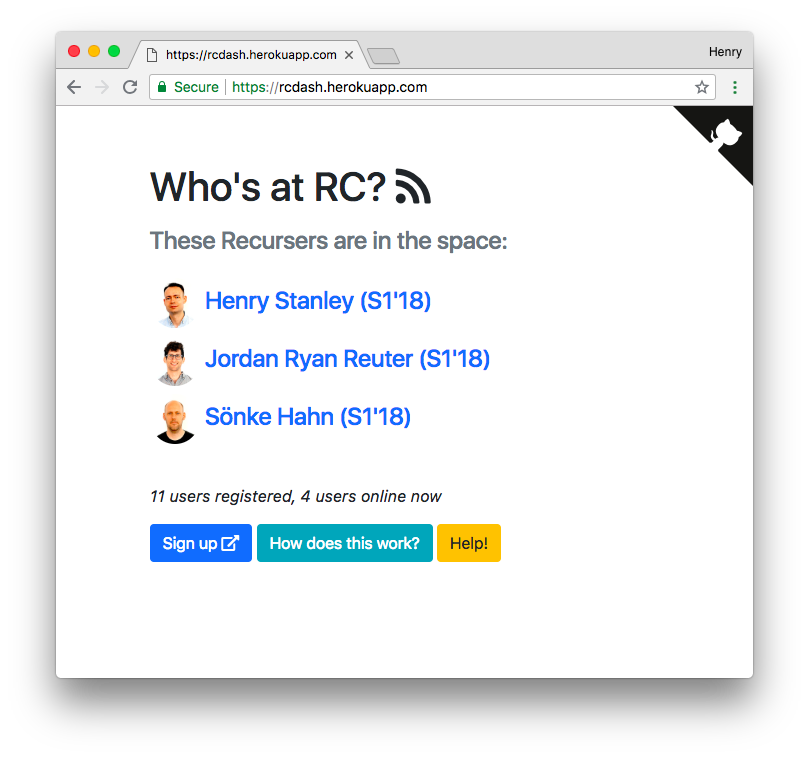

# rcdash

See who's in the [Recurse Center](https://recurse.com) space, live.

I wrote about this [here](https://recurse.henrystanley.com/post/physical-presence-tracking-mac-addresses/).

## How does it work?

Packet sniffing. A Raspberry Pi sits in the space, sniffing packets on the RC main network. It gets a list of unique MAC addresses it saw over the last few seconds, and sends it over to the web server.

The web server checks to see if it knows about that MAC address, and if it does, updates the `last_seen` time of the user that owns it.

The frontend makes a simple AJAX call on a loop to keep the list up to date, hitting the RC API to get extra information about the users in the space (like the URL of their photo).

To register, users send a message containing their MAC address to a Zulip chatbot (which forwards its requests on to the web server).



## Privacy

User MAC addresses are SHA512 hashed with a salt before being stored in the database. The sniffed MAC addresses are hashed and salted with the same salt, so they can be compared to the stored MAC addresses on the server without ever storing a user's plaintext MAC addresses or sending it over the network in the clear.

## Running

The **web server** runs as a regular 12-factor app. It serves up the frontend, listens for new MAC addresses, and is the endpoint for the Zulip webhook.

The following environment variables need to be set:

> `$ bundle exec rackup`

* `ZULIP_SECRET_TOKEN` - secret token that Zulip outgoing webhook sends
* `DATABASE_URL` - full URL to connect to Postgres DB
* `RC_OAUTH_CLIENT_ID` - Recurse Center API OAuth app client ID
* `RC_OAUTH_CLIENT_SECRET` - ...and secret
* `BASE_URL` - URL the site is being hosted at
* `SESSION_SECRET` - a cryptographically random string used to encrypt user cookies
* `SALT` - a random value which will be used as a salt when hashing the discovered MAC addresses

The **packet sniffer** needs to run on a machine that's connected to the main RC wi-fi network. It'll pick up packets sent be devices that are connected to that network and are in range.

To install it, first install tshark, the command-line version of Wireshark:

```
sudo apt-get update && sudo apt-get install tshark
```

Then run `./install_sniffer <path_to_install_location>` to install a system service for running the packet sniffer as a daemon.